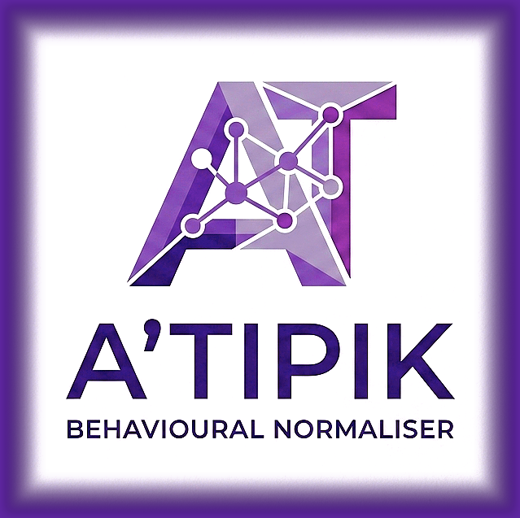
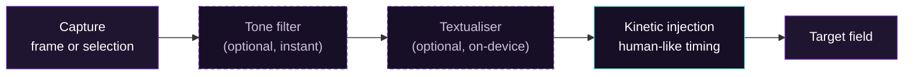
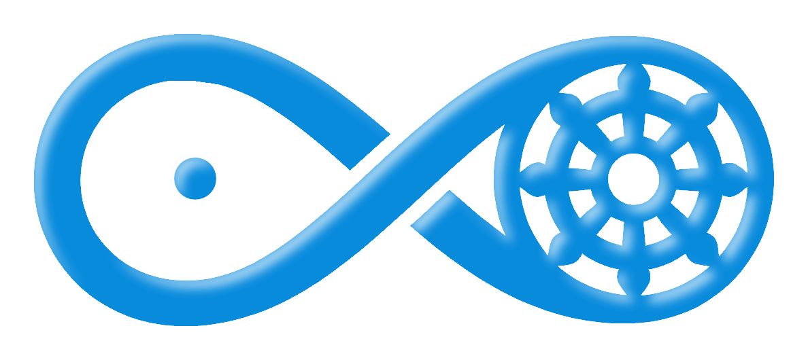

<div align="center">



# A'Tipik

### A behavioural normaliser for atypical typists

[](https://github.com/)
[](https://dotnet.microsoft.com/)
[-3A1070)](LICENSE)
[](CONTRIBUTING.md)

</div>

A'Tipik sits between the keyboard and the screen. When text is ready to be sent,
it types it into the target application with a timing pattern that matches what
behavioural telemetry systems expect, **without changing a single word**. The
person's voice stays intact. The invisible penalty disappears.

It is built for people whose natural typing signature is statistically atypical:
autism spectrum, ADHD, HPI, dyspraxia, sensory processing differences. It runs
fully **without** any local model. The optional Textualiser (local LLM) only
engages when you turn it on.


## Supported platforms and downloads

| Platform | Status | Download |
|---|---|---|
| Windows x64 (Intel / AMD) | Supported | `Atypik-win-x64.zip` from the [latest release](../../releases) |
| Windows ARM64 (Snapdragon / Surface Pro X) | Preview | `Atypik-win-arm64.zip` from the [latest release](../../releases) |
| Linux | Not supported | A'Tipik is a WPF + Win32 app; see [Platform support](#platform-support) |
| macOS | Not supported | Same reason; a port would be a separate project |

Unzip anywhere and run `Atypik.exe`. No installer, no admin rights. The optional
correction model is **not** bundled (to keep the download small). To enable it,
either drop a GGUF file at `src\LLM\textualiser.gguf`, or open **Settings >
Textualiser** and click **Download the correction model** to fetch it from
GitHub into the right folder. The app is fully functional without it.

---

## How it works



The dashed stages are optional and fail safe: if a stage is off or errors, the
text passes through unchanged. The pipeline never breaks on the model. Nothing
leaves the machine.

---

## Why

Behavioural telemetry systems (CAPTCHA solvers, fraud detection, adaptive
learning platforms) classify users from *how* they type, using models trained on
neurotypical data. Atypical typists fall outside that envelope and get silently
flagged: bot labels, account restrictions, scoring penalties they were never
told about. A'Tipik normalises the output signature, not the person.

It also ships an optional **frustration filter**. Atypical people are more often
misread in writing, and the accumulated friction can push someone to send
something they regret. The filter lets the release happen (writing it out is
legitimate) but smooths or blocks the transmission at the action boundary.

## Features

- **Works without any model.** Install and use. Everything below is functional
  out of the box. The local LLM stays optional.
- **Global shortcuts.** `Ctrl+Alt+Space` captures a frame; `Ctrl+Alt+C` grabs
  the currently selected text from any app (web included).
- **Frame recall.** The last frame is remembered; if its target is still open,
  the overlay reopens on it. No redrawing every time.
- **Parallel focus.** The instant you press Enter, A'Tipik hands focus to the
  target *while* any optional correction runs. The first keystroke goes out as
  soon as the target is foreground.
- **Short-text skip.** With the model on, quick replies bypass inference and
  inject instantly.
- **System tray.** Closing the window parks A'Tipik; it stays a shortcut away.
- **Two languages.** English and French, switchable in Settings.
- **Privacy first.** No network requests. No telemetry. All optional LLM
  inference is local. Input never leaves the machine.

## Install (prebuilt)

1. Download `Atypik-win-x64.zip` from the latest [Release](../../releases).
2. Unzip anywhere and run `Atypik.exe`. No installer, no admin rights.
3. Optional: to enable the Textualiser, drop a GGUF model at
   `src\LLM\textualiser.gguf` (or pick any path in Settings).

## Build from source

Prerequisites: [.NET 8 SDK](https://dotnet.microsoft.com/download) (Windows).
Rust is only needed to rebuild the optional local LLM bridge.

```pwsh
git clone https://github.com/<your-org>/A-typik.git
cd A-typik
dotnet build -c Release
# optional: rebuild the local LLM bridge (Rust + CMake + MSVC)
# cd rust\atypik-llm; cargo build --release; cd ..\..
dotnet run -c Release
```

For a portable, self-contained single-file exe:

```pwsh
.\scripts\build-release.ps1
# output: publish\Atypik.exe (+ atypik_llm.dll if Rust was built)
```

## Shortcuts

| Shortcut | Action |
|---|---|
| `Ctrl+Alt+Space` | Capture a frame (reuse the last one if still valid) |
| `Ctrl+Alt+C` | Grab the selected text into the overlay |
| `Enter` | Inject the composed text |
| `Shift+Enter` | Newline in the overlay |
| `Esc` | Cancel / close the overlay |

## Platform support

A'Tipik is **Windows 10/11 only**. It depends on WPF and the Win32 `SendInput`
API, which do not exist on Linux or macOS. A port would require replacing the
entire UI and input-injection layer, so it is out of scope for now.

## For families and educators

Your child or student types differently, not incorrectly. Many online systems
score *how* you type, using data from neurotypical users. When someone types
outside that pattern, the system can quietly restrict or flag them. A'Tipik
types the ready text with a timing pattern these systems expect, without
changing a word. Nothing is stored, nothing is sent to a server.

## Privacy

- No network requests. Ever.
- No telemetry collected.
- Optional LLM inference is local (a GGUF model, on-device). Input never leaves the
  machine.

## Contributing

Pull requests are welcome. Please read [CONTRIBUTING.md](CONTRIBUTING.md) and
[CODE_OF_CONDUCT.md](CODE_OF_CONDUCT.md). To report a private security issue,
see [SECURITY.md](SECURITY.md).

## License

Dual licensed. Personal, academic, and non-commercial use under Apache 2.0;
commercial use requires a separate license from Hope 'n Mind SASU. See
[LICENSE](LICENSE) for the full terms.

---

<div align="center">



**A'Tipik** is published by **Hope 'n Mind SASU**

SIREN 938 261 310 · RCS Brest · contact@hopenmind.com · hopenmind.com

</div>
