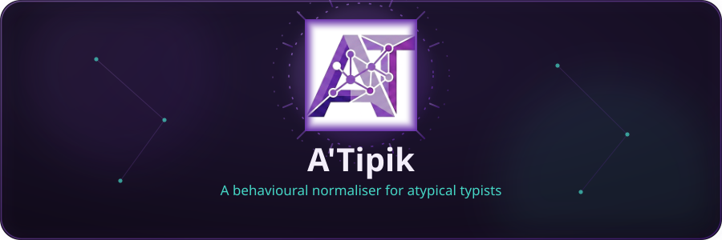
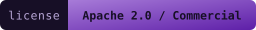
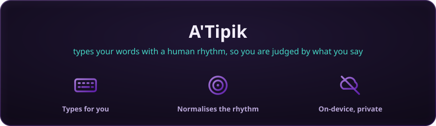
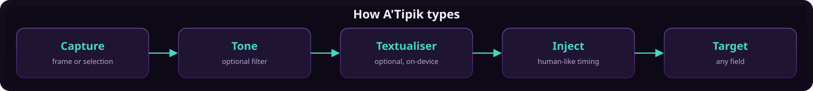
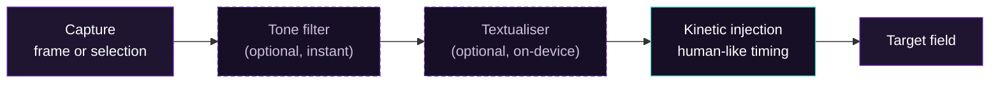
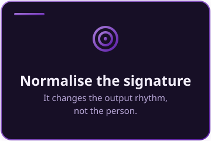
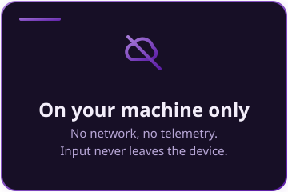
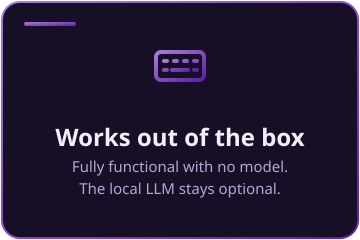

<p align="center">
  
</p>

<p align="center">
  
  
  
  
</p>

# A'Tipik

 A'Tipik is a small companion that types for you.

<p align="center">
  
</p>

<p align="center">
  <a href="https://github.com/hopenmind/Atipik/releases/latest/download/Atypik-Standalone-win-x64.exe"></a>
  <a href="https://github.com/hopenmind/Atipik/releases/latest/download/Atypik-Setup-win-x64.exe"></a>
</p>


<a id="types"></a>


 You write your message; A'Tipik types it into any window, in your place, with a human rhythm. Your words are never changed.

<p align="center">
  
</p>

You write your message, exactly as you want it. A'Tipik then types it into any
window, in your place, the way a person would. Your words are never changed.
Your voice stays yours.

Why does that matter? Because many websites and apps do not only read what you
type. They also watch how you type, and they quietly score you on it. Those
systems learned what "normal" typing looks like, and anything different can be
treated as suspicious. If the way your hands and mind work makes you type a
little differently, in bursts, with pauses, with a rhythm that is uniquely
yours, you may be slowed down, questioned, or held back, for no good reason.
Not because of anything you did wrong. Simply because you are not the average.

A'Tipik takes that unfairness away. It types your words with the kind of rhythm
those systems expect, so you are judged by what you say, not by how your fingers
say it. Nothing about you is corrected. Only the invisible obstacle is.

It also carries a gentle brake for the hard moments. When frustration builds up,
you can let it out freely, in writing. Then, before the message leaves, A'Tipik
can soften the tone and keep the meaning. The relief of writing it stays. The
regret of sending it does not.

Everything happens on your own computer. Nothing is sent anywhere. There is no
account, no tracking, no one watching. Your words never leave your machine.

This tool is built with atypical people in mind first (autism, ADHD, dyspraxia,
high potential, vision differences), and for anyone who has felt that the
machine was measuring them against a standard they were never told about. It is
a tool for fairness and dignity. Nothing more, nothing less.

The app runs fully on its own. The optional correction model only steps in if
you choose to turn it on.



The dashed stages are optional and fail safe: if a stage is off or errors, the
text passes through unchanged. The pipeline never breaks on the model. Nothing
leaves the machine.


<a id="why"></a>


 Behavioural systems score how you type, using models trained on neurotypical data. A'Tipik normalises the output signature, not the person.

<p align="center">
  
</p>

Behavioural telemetry systems (CAPTCHA solvers, fraud detection, adaptive
learning platforms) classify users from *how* they type, using models trained on
neurotypical data. Atypical typists fall outside that envelope and get silently
flagged: bot labels, account restrictions, scoring penalties they were never
told about. A'Tipik normalises the output signature, not the person.

It also ships an optional **frustration filter**. Atypical people are more often
misread in writing, and the accumulated friction can push someone to send
something they regret. The filter lets the release happen (writing it out is
legitimate) but smooths or blocks the transmission at the action boundary.


<a id="privacy"></a>


 Everything happens on your own computer. No account, no tracking, no one watching.

<p align="center">
  
</p>

- No network requests. Ever.
- No telemetry collected.
- Optional LLM inference is local (a GGUF model, on-device). Input never leaves the
  machine.


<a id="features"></a>


 Install and use. Everything is functional out of the box; the local LLM stays optional.

<p align="center">
  
</p>

- **Works without any model.** Install and use. Everything below is functional
  out of the box. The local LLM stays optional.
- **Global shortcuts.** `Ctrl+Alt+Space` captures a frame; `Ctrl+Alt+C` grabs
  the currently selected text from any app (web included).
- **Frame recall.** The last frame is remembered; if its target is still open,
  the overlay reopens on it. No redrawing every time.
- **Parallel focus.** The instant you press Enter, A'Tipik hands focus to the
  target *while* any optional correction runs. The first keystroke goes out as
  soon as the target is foreground.
- **Short-text skip.** With the model on, quick replies bypass inference and
  inject instantly.
- **System tray.** Closing the window parks A'Tipik; it stays a shortcut away.
- **Privacy first.** No network requests. No telemetry. All optional LLM
  inference is local. Input never leaves the machine.


<a id="shortcuts"></a>


 A few global shortcuts drive the whole flow, from any application.

| Shortcut | Action |
|---|---|
| `Ctrl+Alt+Space` | Capture a frame (reuse the last one if still valid) |
| `Ctrl+Alt+C` | Grab the selected text into the overlay |
| `Enter` | Inject the composed text |
| `Shift+Enter` | Newline in the overlay |
| `Esc` | Cancel / close the overlay |


<a id="families"></a>


 Your child or student types differently, not incorrectly.

Your child or student types differently, not incorrectly. Many online systems
score *how* you type, using data from neurotypical users. When someone types
outside that pattern, the system can quietly restrict or flag them. A'Tipik
types the ready text with a timing pattern these systems expect, without
changing a word. Nothing is stored, nothing is sent to a server.


<a id="technique"></a>


 How you are measured today, the deeper risk of normalising human rhythm, and where A'Tipik stands.

### How you are measured today
Many websites and apps do not only read what you type. They record how you type: the time between keys, the rhythm of bursts and pauses, the small hesitations and corrections, how you move the mouse, how you scroll. Together this is called behavioural biometrics, or keystroke dynamics, and it shows up in concrete places:

- The "I'm not a robot" checks that score your mouse movements and typing, not just the checkbox you click.
- Login and payment screens that quietly run a risk score before letting you in.
- "Step-up" or continuous authentication that re-checks, mid-session, whether the person at the keyboard is still you.
- Exam and learning platforms that score engagement and "authenticity" from how you behave.

It runs invisibly. You are almost never told it is happening, and there is usually no way to turn it off.

These models were trained on the average of many people. So they treat the average as normal, and anything that deviates as suspicious. For someone whose natural rhythm is shaped by autism, ADHD, dyspraxia, a vision difference, or simply a different way of moving through the world, that deviation is not a threat. It is just how they are. The system does not know the difference, and so it flags, slows, or blocks them.

### The deeper risk: normalizing human rhythm
The danger is bigger than false alarms. As more of public life (work, school, healthcare, money, access) sits behind systems that quietly demand a normal rhythm, conformity stops being a choice and becomes the price of entry. People learn, without anyone saying so, to type, move, and react like everyone else, just to be allowed in. The burden flips: it is no longer the systems that must adapt to the diversity of real people; it is the people who must adapt, in secret, to the average. That erodes three things at once: neurodiversity (the right to a different rhythm), privacy (constant, silent measurement), and ultimately human sovereignty, the idea that a person is the source of their own behaviour, and not an input to be shaped.

### Where A'Tipik stands
This is not rebellion, and it is not a rejection of classification itself. Classifying behaviour has a legitimate purpose: catching fraud, bots, and abuse. The problem is the starting assumption.

Today these algorithms begin from the postulate that everyone is neurotypical, and treat any deviation as the exception to investigate. A'Tipik argues for the inverse: the humane default is to assume the operator may be neuro-atypical, and to build diverse rhythms and ways of thinking into the model as a first-class component from the start. The profile should then refine, case by case, toward a neurotypical classification, to confirm or refute that hypothesis, never the other way around. Difference should be the prior, not the anomaly.

While the industry refines its defaults, A'Tipik is a practical stopgap: it lets a real person keep their own rhythm and still pass through, today, without waiting for the systems to change. The goal is not to defeat classification, but to push it toward one that begins by accepting the full spectrum of how human minds work, and only then narrows. Ideally this tool becomes unnecessary. Until then, it restores a measure of fairness.


<a id="contributing"></a>


 Pull requests are welcome.

Pull requests are welcome. Please read [CONTRIBUTING.md](CONTRIBUTING.md) and
[CODE_OF_CONDUCT.md](CODE_OF_CONDUCT.md). To report a private security issue,
see [SECURITY.md](SECURITY.md).


<a id="install"></a>


 Two ways in: a single standalone exe that just runs, or a classic installer with a Start Menu shortcut. No admin rights either way.

<p align="center">
  <a href="https://github.com/hopenmind/Atipik/releases/latest/download/Atypik-Standalone-win-x64.exe"></a>
</p>

| Platform | File |
|---|---|
| Standalone (Windows x64, no install) | [Atypik-Standalone-win-x64.exe](https://github.com/hopenmind/Atipik/releases/latest/download/Atypik-Standalone-win-x64.exe) |
| Installer (Windows x64) | [Atypik-Setup-win-x64.exe](https://github.com/hopenmind/Atipik/releases/latest/download/Atypik-Setup-win-x64.exe) |

**Standalone.** Download `Atypik-Standalone-win-x64.exe`, double-click, and it runs. One self-contained file, no install, no admin rights: the runtime and the brand assets are all embedded.

**Installer.** Prefer a classic setup? Download `Atypik-Setup-win-x64.exe` and run it. A'Tipik installs itself and adds a Start Menu shortcut, and can be removed from Add or remove programs.

**The optional correction model** is not bundled, to keep the download small. To enable it, open **Settings > Textualiser** and click **Download the correction model**, or drop a GGUF file at `src\LLM\textualiser.gguf`. The app is fully functional without it.

Prerequisites: [.NET 8 SDK](https://dotnet.microsoft.com/download) (Windows).
Rust is only needed to rebuild the optional local LLM bridge.

```pwsh
git clone https://github.com/hopenmind/Atipik.git
cd A-typik
dotnet build -c Release
# optional: rebuild the local LLM bridge (Rust + CMake + MSVC)
# cd rust\atypik-llm; cargo build --release; cd ..\..
dotnet run -c Release
```

For a portable, self-contained single-file exe:

```pwsh
.\scripts\build-release.ps1
# output: publish\Atypik.exe (+ atypik_llm.dll if Rust was built)
```


<a id="limitations"></a>


 **Windows 10/11 only.** It depends on WPF and the Win32 SendInput API, which do not exist on Linux or macOS. A port would require replacing the entire UI and input-injection layer, so it is out of scope for now.

 **ARM64 is a preview.** The Windows ARM64 build (Snapdragon, Surface Pro X) ships without the optional local LLM bridge.

 **The correction model is not bundled.** To keep the download small, the optional GGUF model is fetched on demand or dropped in manually. The app is fully functional without it.


<p align="center">[Security](SECURITY.md) &nbsp;&middot;&nbsp; [Contributing](CONTRIBUTING.md) &nbsp;&middot;&nbsp; [License](LICENSE)</p>

<p align="center"><sub>Dual licensed. Personal, academic and non-commercial use under Apache 2.0; commercial use requires a separate license from Hope 'n Mind SASU. See LICENSE for the full terms.</sub></p>

<br>

<p align="center"><sub>A'Tipik is published by <b>Hope 'n Mind SASU</b></sub></p>
<p align="center"></p>
<p align="center"><sub>SIREN 938 261 310 &middot; RCS Brest &middot; contact@hopenmind.com &middot; hopenmind.com</sub></p>

<p align="center"><em>You are judged by what you say, not by how your fingers say it.</em></p>
